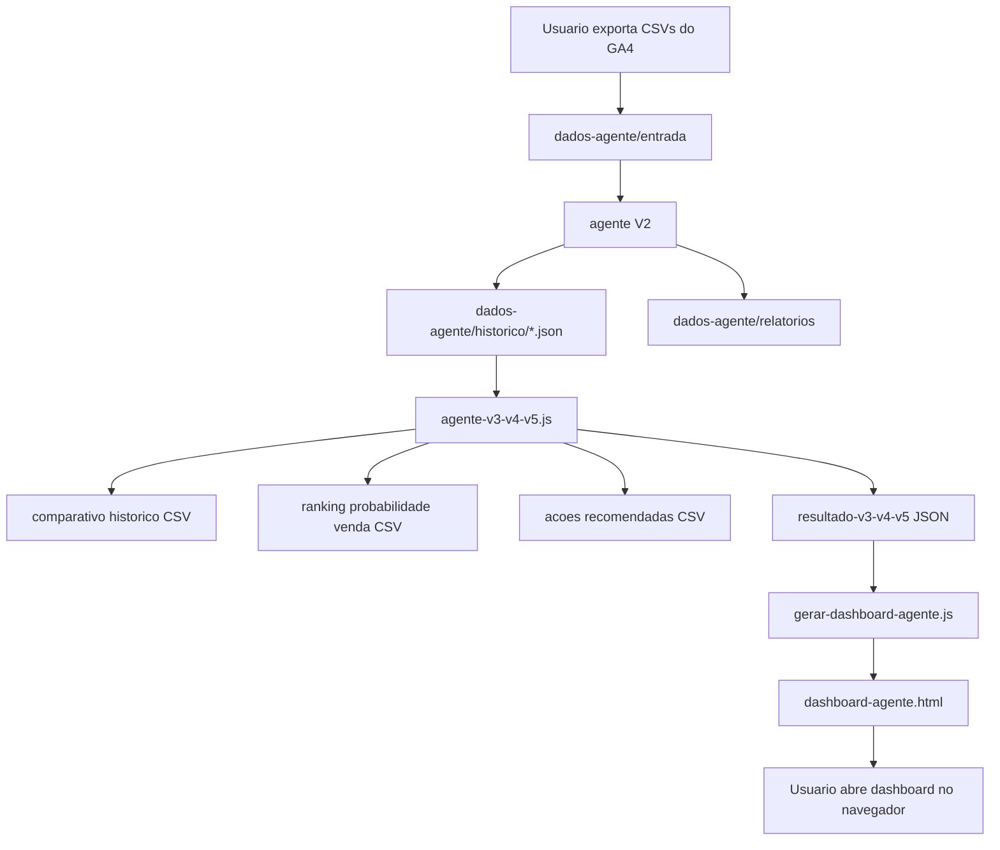
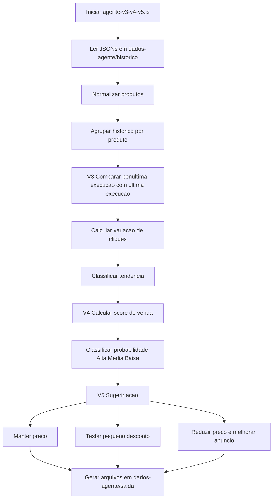
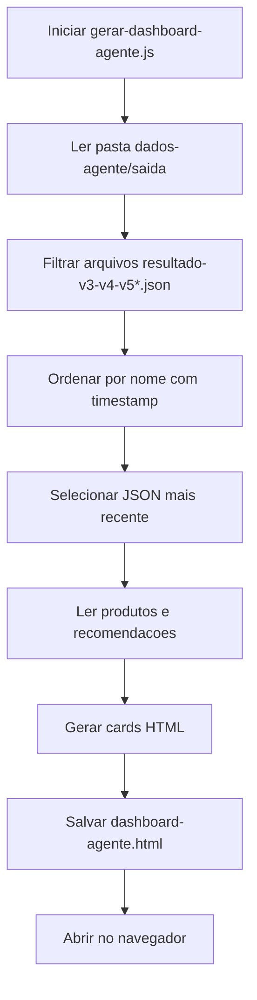
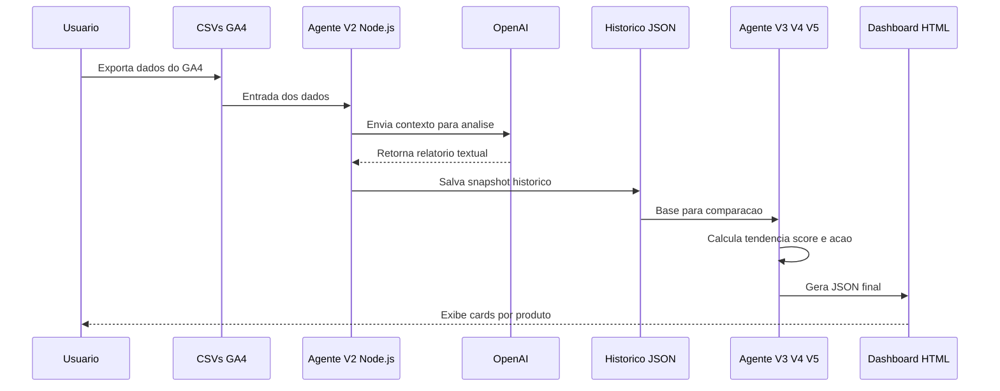

# Fluxos do Agente de IA - Anuncios de Eletrodomesticos

## 1. Fluxo geral do projeto

## 2. Fluxo do agente V3, V4 e V5

## 3. Fluxo do dashboard HTML

## 4. Relacao entre arquivos principais

```mermaid
flowchart LR
    A[src/app/app.ts] --> B[Catalogo Angular]
    B --> C[Google Analytics 4]
    C --> D[CSVs exportados]

    D --> E[dados-agente/entrada]
    E --> F[Agente V2]
    F --> G[dados-agente/historico JSON]

    G --> H[agente-v3-v4-v5.js]
    H --> I[resultado-v3-v4-v5 JSON]

    I --> J[gerar-dashboard-agente.js]
    J --> K[dashboard-agente.html]
```

## 5. Fluxo com OpenAI

